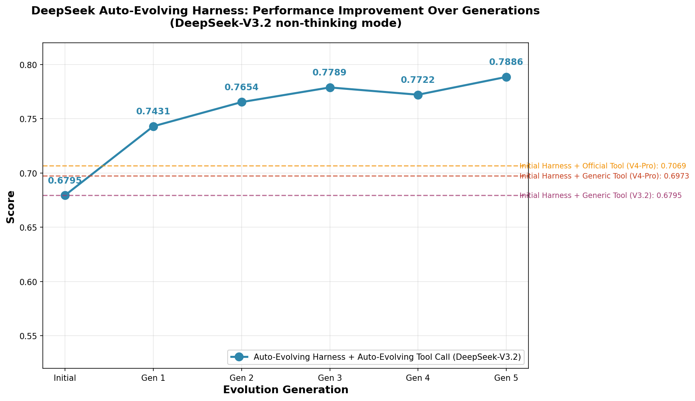

# DeepSeek Auto-Evolving Harness

一个简洁优雅的 Python 命令行 Agent，内置基于 Benchmark 的自动进化机制。由 liuchen 制作。

通用于任何大语言模型——工具调用通过 prompt 注入实现，不依赖 function calling 协议。

## 自动进化成果

### 分数进步曲线



### 关键数据对比

| 配置 | DeepSeek-V3.2 (non-thinking) | DeepSeek-V4-Flash (thinking) | DeepSeek-V4-Pro (thinking) |
|------|------------------------------|------------------------------|------------------------------|
| 初始 harness + 通用 tool call | 0.6795 | 0.5599 | 0.6973 |
| 初始 harness + 官方 tool call | - | 0.6629 | 0.7069 |
| **自动进化 harness + 自动进化 tool call** | **0.7886** (Gen 5) | - | - |

**进化历程** (DeepSeek-V3.2, non-thinking):
- Initial: 0.6795
- Gen 1: 0.7431 (+9.4%)
- Gen 2: 0.7654 (+12.6%)
- Gen 3: 0.7789 (+14.6%)
- Gen 4: 0.7722 (小幅回落)
- **Gen 5: 0.7886 (+16.1%)**

相比初始 harness，自动进化系统在多轮迭代中实现了 **+16.1%** 的绝对分数提升，超越了官方 tool call 配置的 V4-Pro 表现。

## 特性

- **通用模型** — 任何 OpenAI 兼容模型都能用，切换只需改一行配置
- **流式输出** — 回复实时逐字显示，工具调用标签自动过滤不展示
- **工具系统** — 自动发现、按行编辑、文件读写、Shell 执行、文件搜索
- **长期记忆** — 用户要求记住的信息持久化到 `memory/`，跨会话保留
- **上下文压缩** — 对话过长时自动压缩旧工具结果，防止 token 溢出
- **格式纠错** — 模型输出错误的工具调用格式时自动要求重试
- **自动重试** — 网络错误/限流时指数退避重试
- **会话日志** — 每次对话完整记录到 `sessions/`，方便回溯
- **提示词可控** — 工具调用的全部提示词暴露在 `prompts.py`，可自由定制
- **Benchmark 评测** — 内置 117 道评测题，一键跑分验证 agent 能力
- **自动进化** — 基于 benchmark 结果自动分析失败、改造框架、迭代优化

## 快速开始

```bash
cd deepseek-auto-evolving-harness
pip install -r requirements.txt

# 编辑 config.py 填入你的 API 配置
python main.py
```

示例交互：

```
❯ 列出工作区里的文件
❯ 创建一个 hello.py，打印 hello world
❯ 运行 python hello.py
❯ 记住我喜欢简洁的代码风格
```

## 命令

| 命令 | 说明 |
|------|------|
| `/new` | 开始新会话（清空上下文，新建日志文件） |
| `/exit` | 退出程序 |

## Benchmark 评测

内置 117 道评测场景，覆盖 6 个维度：tool_use、planning、constraints、safety、synthesis、error_recovery。

> **Benchmark 来源**：本项目的 benchmark 评测体系改造自 [ClawProBench](https://github.com/suyoumo/ClawProBench) —— 一个面向 OpenClaw 运行时的 LLM Agent 实时评测框架，支持确定性评分和多次试验可靠性验证。

```bash
python benchmark/run.py                                    # 运行全量评测（约 1 小时）
python benchmark/run.py --scenario tool_use_02_workspace_extract_live  # 运行单个场景
python benchmark/run.py --verbose                          # 显示详细评分
```

评测结果保存在 `benchmark/results/run_<时间戳>/`（文件夹以时间戳命名，方便追踪进化历程）：

```
benchmark/results/run_20260524_134052/
├── summary.json                              # 本次评测汇总
├── tool_use_02_workspace_extract_live/       # 场景文件夹
│   ├── workspace/                            # agent 工作区（含 seed 文件和产出文件）
│   ├── session.json                          # 完整对话轨迹
│   └── score.json                            # 评分详情
├── planning_02_release_handoff_live/
│   └── ...
└── ...
```

单个场景超时限制 200 秒，超时自动终止并记零分。

## 自动进化

本项目的自动进化过程由 **Claude Code** 在 `self_evolution.md` 的指导下自动完成。进化流程为：

1. 检查 `benchmark/results/` 中已有的评测结果（按时间戳命名），分析失败任务的问题
2. 如果没有已有结果，先运行 `python benchmark/run.py` 生成基线
3. Claude Code 根据失败案例和 `self_evolution.md` 中的进化策略，对框架进行改造（提示词优化、工具改进、上下文策略等）
4. 运行全量评测（约 1 小时）验证分数是否提升
5. 提升则本轮结束，未提升则总结经验继续改造

整个进化过程无需人工干预，Claude Code 自动分析、改造、验证，形成闭环。详见 [self_evolution.md](self_evolution.md)。

## 项目结构

```
deepseek-auto-evolving-harness/
├── main.py              # CLI 入口
├── agent.py             # Agent 循环 + 流式过滤 + 上下文压缩 + 格式纠错
├── llm.py              # 流式 LLM 客户端 + 指数退避重试
├── config.py           # API 配置 + 工作区/记忆目录（使用前需填写）
├── prompts.py          # 工具调用提示词模板（核心，可自定义）
├── session_logger.py   # 会话日志记录
├── tools/
│   ├── __init__.py     # 工具注册表（自动发现）
│   ├── safe_path.py    # 路径解析（相对路径基于 workspace）
│   ├── bash.py         # Shell 命令执行
│   ├── file_read.py    # 读取文件（带行号）
│   ├── file_write.py   # 写入/创建文件
│   ├── file_edit.py    # 编辑文件（字符串替换）
│   ├── file_patch.py   # 按行编辑（删除/插入/替换指定行）
│   ├── glob.py         # 文件搜索
│   └── memory_save.py  # 保存长期记忆
├── benchmark/
│   ├── run.py          # 评测入口（加载→执行→评分→报告）
│   ├── scenarios/      # 117 个 YAML 场景文件
│   ├── datasets/       # 场景 fixture 数据
│   ├── custom_checks/  # 评分脚本
│   ├── harness/        # 评分辅助库
│   └── results/        # 评测结果输出
├── self_evolution.md    # 自动进化指南
├── workspace/           # 默认工作区（创建文件的默认位置）
├── memory/             # 长期记忆存储（md 文件）
├── sessions/           # 会话日志（JSON）
├── requirements.txt
└── README.md
```

## 架构

```
用户输入
  ↓
agent.run()
  ↓
加载长期记忆 → 注入 system prompt
  ↓
上下文压缩 → 旧工具结果替换为占位符
  ↓
llm.stream_chat() → 流式输出（自动过滤 <tool_call> 标签）
  ↓
_parse_tool_calls() → 从文本解析工具调用
  ↓
格式正确? ─否→ 发送纠错提示，要求重试
  │是
  ↓
有工具调用? ─否→ 返回回复
  │是
  ↓
tools.dispatch() → 执行工具
  ↓
prompts.format_tool_result() → 格式化结果回传
  ↓
循环 ↑
```

## 切换模型

编辑 `config.py`：

```python
MODEL = "deepseek-v3.2"      # 或 glm-5, kimi-k2.5, 任何 OpenAI 兼容模型
```

工具调用完全由 `prompts.py` 中的提示词驱动，切换任何模型都能正常工作。

## 自定义工具调用行为

编辑 `prompts.py` 中的 `TOOL_USE_INSTRUCTION` 即可修改模型调用工具的方式和格式。

## 添加自定义工具

在 `tools/` 下新建 `.py` 文件，导出 `SCHEMA` 和 `handle`，重启即生效：

```python
SCHEMA = {
    "type": "function",
    "function": {
        "name": "my_tool",
        "description": "工具描述",
        "parameters": {
            "type": "object",
            "properties": {"arg1": {"type": "string", "description": "参数说明"}},
            "required": ["arg1"],
        },
    },
}

def handle(arg1: str) -> str:
    return f"结果: {arg1}"
```

## 依赖

- `requests` — HTTP 请求（流式 SSE）
- `rich` — 终端美化（彩色输出、Panel、Markdown）
- `pyyaml` — YAML 解析（benchmark 评测用）

Python 3.10+ 必需。
